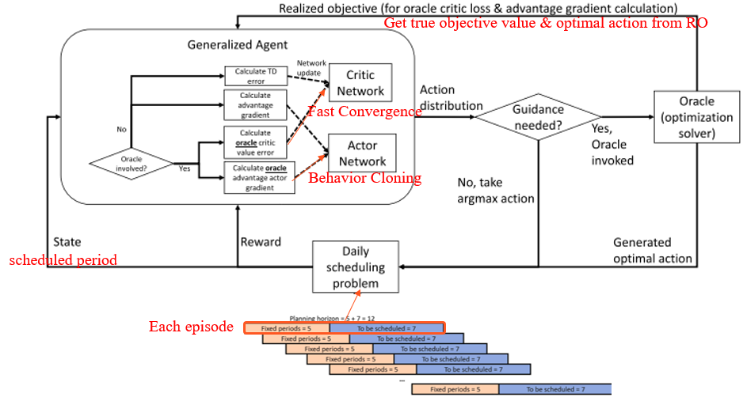

# Robust-Optimization-Guiding-Deep-Reinforcement-Learning-Scheduling

This repository introduces **Optimization-Guided Reinforcement Learning (RLeRO)**, an innovative framework that combines **Robust Optimization (RO)** with **Reinforcement Learning (RL)** to improve decision-making and scheduling performance in uncertain and dynamic environments. Inspired by research in chemical production scheduling, this approach bridges the gap between theoretical optimization and practical applications in dynamic, uncertain conditions.

## Key Features

1. **Optimization-Guided Learning**: Integrates RO into the RL training phase to enhance learning stability and convergence.
2. **Enhanced Robustness**: Addresses demand and yield uncertainties while providing conservative and resilient decisions.

## Methodology Overview

1. **Problem Setup**:
   - The framework is designed for scheduling tasks with uncertain parameters like fluctuating demands and yields.
   - It uses a robust optimization model to calculate optimal solutions and guide the RL agent.

2. **Algorithm Components**:
   - **Actor Network**: Implements Behavior Cloning for supervised learning of RO-guided actions.
   - **Critic Network**: Accelerates learning by leveraging more accurate reward signals.
   - **Entropy Regularization**: Encourages exploration while avoiding overfitting to the RO model.
   
   

3. **Training Workflow**:
   - A rolling window schedule transforms problem setups into RL episodes.
   - The RO solver intervenes selectively, guiding the RL agent when uncertainties exceed a predefined threshold.

## Results & Performance

- **Fast Convergence**: The integration of RO reduces the trial-and-error process typical in RL.
- **Improved Robustness**: The RLeRO framework delivers more stable and robust decisions compared to standard RL approaches.
- **Efficient Scalability**: Performs well across various problem sizes, ensuring practicality in real-world applications.

### Benchmark Comparisons:
- **RLeRO** vs. **Traditional RL**: Demonstrates superior robustness and solution quality under high uncertainty.
- **RLeRO** vs. **RO**: Offers comparable results with reduced computation times, making it ideal for frequent rescheduling.

## References

The methodology is inspired by the following research:
- Lee, C.-Y., Huang, Y.-T., & Chen, P.-J. (2024). *Robust-optimization-guiding deep reinforcement learning for chemical material production scheduling*. Computers & Chemical Engineering, 187, 108745. [DOI Link](https://doi.org/10.1016/j.compchemeng.2024.108745)